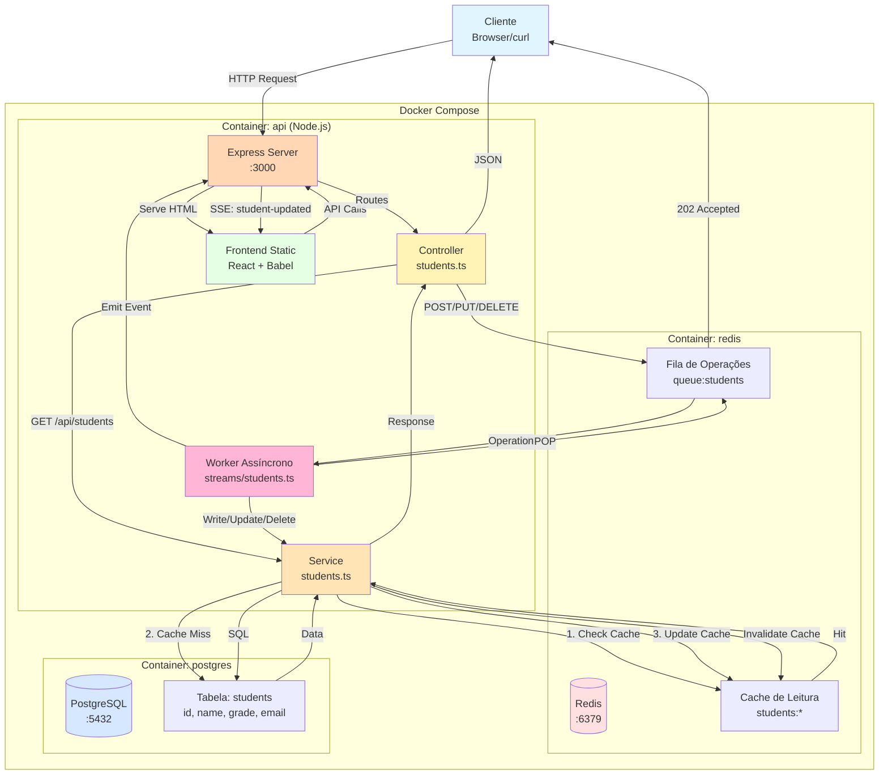

# API de Gerenciamento de Estudantes

Sistema de CRUD assíncrono para gerenciamento de estudantes, construído com Node.js, Express, PostgreSQL e Redis. A aplicação utiliza uma arquitetura orientada a eventos onde operações de escrita são enfileiradas em Redis e processadas por um worker assíncrono, enquanto operações de leitura utilizam cache para otimização de performance.

## 📋 Índice

- [Visão Geral](#visão-geral)
- [Como Executar a Aplicação](#como-executar-a-aplicação)
- [Como Parar a Aplicação](#como-parar-a-aplicação)
- [Scripts de CRUD](#scripts-de-crud)
- [Endpoints da API](#endpoints-da-api)
- [Arquitetura](#arquitetura)
- [Tecnologias Utilizadas](#tecnologias-utilizadas)
- [Estrutura do Projeto](#estrutura-do-projeto)
- [Manipulação Direta do Redis](#-manipulação-direta-do-redis)

## 🎯 Visão Geral

Esta aplicação implementa um sistema completo de gerenciamento de estudantes com as seguintes características:

- **Backend**: API REST em Node.js + Express com TypeScript
- **Banco de Dados**: PostgreSQL para persistência de dados
- **Cache**: Redis para cache de leitura e fila de operações assíncronas
- **Frontend**: Interface React (via Babel in-browser) com Server-Sent Events (SSE) para atualizações em tempo real
- **Infraestrutura**: Docker Compose para orquestração de containers

### Características Principais

- **CRUD Assíncrono**: Operações de escrita (POST, PUT, DELETE) retornam imediatamente com status `202 Accepted` e são processadas em background por um worker
- **Cache Inteligente**: Leituras consultam primeiro o cache Redis; em caso de miss, buscam no PostgreSQL e atualizam o cache
- **Notificações em Tempo Real**: SSE notifica o frontend automaticamente quando operações são concluídas
- **Alta Disponibilidade**: Healthchecks e restart policies garantem resiliência dos serviços

## 🚀 Como Executar a Aplicação

### Pré-requisitos

- [Docker](https://docs.docker.com/get-docker/) instalado (versão 20.10 ou superior)
- [Docker Compose](https://docs.docker.com/compose/install/) instalado (versão 2.0 ou superior)

### Método 1: Usando o Script de Execução (Recomendado)

O script [run.sh](run.sh) automatiza o processo de inicialização, aguarda os healthchecks e exibe os logs:

```bash
./run.sh
```

Este script:

1. Faz rebuild das imagens Docker
2. Inicia todos os containers (api, postgres, redis)
3. Aguarda os healthchecks dos serviços
4. Exibe logs da API em tempo real
5. Ao sair (Ctrl+C), executa shutdown completo com remoção de volumes

### Método 2: Comandos Docker Compose Manuais

Para maior controle sobre o ciclo de vida dos containers:

```bash
# Subir todos os serviços em background
docker compose up -d --build

# Ver logs da API
docker compose logs -f api

# Ver status dos containers
docker compose ps

# Ver logs de todos os serviços
docker compose logs -f
```

### Acessando a Aplicação

Após a inicialização, a aplicação estará disponível em:

- **Frontend**: [http://localhost:3000](http://localhost:3000)
- **API**: [http://localhost:3000/api/students](http://localhost:3000/api/students)
- **PostgreSQL**: `localhost:5432` (usuário: `admin`, senha: `admin`, database: `students`)
- **Redis**: `localhost:6379`

### Execução Local (Alternativa sem Docker)

Para executar diretamente no host sem Docker:

1. Certifique-se de ter PostgreSQL e Redis rodando localmente
2. Configure as variáveis de ambiente:

```bash
export PGUSER=admin
export PGPASSWORD=admin
export PGHOST=localhost
export PGDATABASE=students
export REDIS_HOST=localhost
export REDIS_PORT=6379
```

3. Instale as dependências e execute:

```bash
npm install
npm start
```

O servidor estará disponível em `http://localhost:3000`.

## 🛑 Como Parar a Aplicação

### Usando o Script de Shutdown

O script [shutdown.sh](shutdown.sh) para todos os containers e remove volumes:

```bash
./shutdown.sh
```

⚠️ **Atenção**: Este comando remove os volumes do Docker, **apagando todos os dados** do PostgreSQL e Redis.

### Comandos Manuais

Para parar sem remover dados:

```bash
# Parar e remover containers, mas preservar volumes
docker compose down
```

Para parar e remover tudo (incluindo dados):

```bash
# Parar, remover containers e volumes
docker compose down --volumes --remove-orphans --timeout 0
```

Para apenas pausar temporariamente:

```bash
# Pausar sem remover
docker compose stop

# Retomar depois
docker compose start
```

## 📝 Scripts de CRUD

A aplicação inclui dois scripts automatizados para testar o fluxo completo de CRUD:

### Script 1: CRUD via CURL ([scripts/crud-curl.sh](scripts/crud-curl.sh))

Testa o CRUD completo usando requisições HTTP diretas via `curl`.

**Pré-requisitos:**

- `curl` instalado
- `node` ou `nodejs` instalado (para parse de JSON)

**Execução:**

```bash
./scripts/crud-curl.sh
```

**Variáveis de Ambiente:**

```bash
# Customizar URL base (padrão: http://localhost:3000)
BASE_URL=http://localhost:3000 ./scripts/crud-curl.sh
```

**O que o script faz:**

1. **CREATE**: Envia `POST /api/students` com dados de um novo aluno
2. **WAIT**: Aguarda 2 segundos para o worker processar a operação
3. **READ ALL**: Lista todos os alunos com `GET /api/students`
4. **UPDATE**: Atualiza o aluno criado com `PUT /api/students/:id`
5. **WAIT**: Aguarda processamento da atualização
6. **READ ONE**: Busca o aluno específico com `GET /api/students/:id`
7. **DELETE**: Remove o aluno com `DELETE /api/students/:id`
8. **WAIT**: Aguarda processamento da remoção
9. **VERIFY**: Confirma remoção listando todos os alunos novamente

### Script 2: CRUD via WebDriver ([scripts/crud-webdriver.sh](scripts/crud-webdriver.sh))

Testa o CRUD usando Selenium WebDriver para interagir com o frontend no navegador.

**Pré-requisitos:**

- `firefox-esr` ou `firefox` instalado
- `node` ou `nodejs` instalado
- Pacote `selenium-webdriver` (instalado automaticamente pelo script se não existir)

**Execução:**

```bash
./scripts/crud-webdriver.sh
```

**Variáveis de Ambiente:**

```bash
# Customizar URLs
BASE_URL=http://localhost:3000 \
BROWSER_BASE_URL=http://localhost:3000 \
SELENIUM_HEADLESS=true \
WAIT_TIMEOUT_SECONDS=10 \
./scripts/crud-webdriver.sh
```

**Variáveis configuráveis:**

- `BASE_URL`: URL da API (padrão: `http://localhost:3000`)
- `BROWSER_BASE_URL`: URL do frontend (padrão: `http://localhost:3000`)
- `SELENIUM_HEADLESS`: Executar sem interface gráfica (padrão: `false`)
- `WAIT_TIMEOUT_SECONDS`: Timeout para operações (padrão: `10`)

**O que o script faz:**

1. Verifica/instala dependências (Firefox, Selenium WebDriver)
2. Abre o frontend no navegador
3. Cria um aluno via formulário web
4. Aguarda notificação SSE da conclusão
5. Verifica aparição do aluno na tabela HTML
6. Atualiza o aluno via interface
7. Verifica atualização na tabela
8. Remove o aluno via interface
9. Confirma remoção da tabela

## 🌐 Endpoints da API

### Resumo dos Endpoints

| Método   | Path                   | Descrição                    | Status Codes                                                  |
| -------- | ---------------------- | ---------------------------- | ------------------------------------------------------------- |
| `GET`    | `/`                    | Serve o frontend             | `200` OK                                                      |
| `GET`    | `/api/students`        | Lista todos os alunos        | `200` OK, `500` Erro                                          |
| `GET`    | `/api/students/:id`    | Busca aluno por ID           | `200` OK, `400` ID inválido, `404` Não encontrado, `500` Erro |
| `POST`   | `/api/students`        | Cria novo aluno (assíncrono) | `202` Accepted, `400` Payload inválido, `500` Erro            |
| `PUT`    | `/api/students/:id`    | Atualiza aluno (assíncrono)  | `202` Accepted, `400` Payload/ID inválido, `500` Erro         |
| `DELETE` | `/api/students/:id`    | Remove aluno (assíncrono)    | `202` Accepted, `400` ID inválido, `500` Erro                 |
| `GET`    | `/api/students/events` | Stream SSE de notificações   | `200` OK (streaming)                                          |

### Detalhes dos Endpoints

#### 1. GET / - Frontend

Serve a página HTML do frontend.

**Resposta:**

- `200 OK`: Retorna `index.html`

---

#### 2. GET /api/students - Listar Todos os Alunos

Retorna array com todos os alunos cadastrados.

**Resposta de Sucesso:**

```json
[
  {
    "id": "2026001",
    "name": "John Doe",
    "grade": "10",
    "email": "john@example.com"
  },
  {
    "id": "2026002",
    "name": "Jane Smith",
    "grade": "9",
    "email": "jane@example.com"
  }
]
```

**Status Codes:**

- `200 OK`: Lista retornada com sucesso
- `500 Internal Server Error`: Erro ao consultar banco/cache

---

#### 3. GET /api/students/:id - Buscar Aluno por ID

Retorna um aluno específico pelo ID.

**Parâmetros:**

- `id` (path): ID do aluno (string)

**Resposta de Sucesso:**

```json
{
  "id": "2026001",
  "name": "John Doe",
  "grade": "10",
  "email": "john@example.com"
}
```

**Status Codes:**

- `200 OK`: Aluno encontrado
- `400 Bad Request`: ID inválido ou vazio
- `404 Not Found`: Aluno não encontrado
- `500 Internal Server Error`: Erro ao consultar banco/cache

---

#### 4. POST /api/students - Criar Novo Aluno

Cria um novo aluno de forma assíncrona. A operação é enfileirada e processada por um worker.

**Payload (JSON):**

```json
{
  "id": "2026001",
  "name": "John Doe",
  "grade": "10",
  "email": "john@example.com"
}
```

**Campos obrigatórios (todos strings):**

- `id`: ID único do aluno
- `name`: Nome completo
- `grade`: Série/turma
- `email`: Email do aluno

**Resposta de Sucesso:**

```json
{
  "operationId": "op:1708876543210:abc123",
  "type": "create",
  "studentId": "2026001",
  "status": "pending",
  "attempts": 0,
  "updatedAt": "2026-02-25T10:15:43.210Z"
}
```

**Status Codes:**

- `202 Accepted`: Operação enfileirada com sucesso
- `400 Bad Request`: Payload inválido ou campos faltando
- `500 Internal Server Error`: Erro ao enfileirar operação

---

#### 5. PUT /api/students/:id - Atualizar Aluno

Atualiza dados de um aluno de forma assíncrona (update parcial).

**Parâmetros:**

- `id` (path): ID do aluno a atualizar

**Payload (JSON):** Ao menos um campo deve ser fornecido:

```json
{
  "name": "Jane Doe",
  "grade": "11",
  "email": "jane.doe@example.com"
}
```

**Campos opcionais (strings):**

- `name`: Novo nome
- `grade`: Nova série/turma
- `email`: Novo email

**Resposta de Sucesso:**

```json
{
  "operationId": "op:1708876543250:def456",
  "type": "update",
  "studentId": "2026001",
  "status": "pending",
  "attempts": 0,
  "updatedAt": "2026-02-25T10:15:43.250Z"
}
```

**Status Codes:**

- `202 Accepted`: Operação enfileirada com sucesso
- `400 Bad Request`: ID inválido ou payload sem campos válidos
- `500 Internal Server Error`: Erro ao enfileirar operação

---

#### 6. DELETE /api/students/:id - Remover Aluno

Remove um aluno de forma assíncrona.

**Parâmetros:**

- `id` (path): ID do aluno a remover

**Resposta de Sucesso:**

```json
{
  "operationId": "op:1708876543300:ghi789",
  "type": "delete",
  "studentId": "2026001",
  "status": "pending",
  "attempts": 0,
  "updatedAt": "2026-02-25T10:15:43.300Z"
}
```

**Status Codes:**

- `202 Accepted`: Operação enfileirada com sucesso
- `400 Bad Request`: ID inválido
- `500 Internal Server Error`: Erro ao enfileirar operação

---

#### 7. GET /api/students/events - Server-Sent Events (SSE)

Stream de eventos em tempo real para notificação de operações concluídas.

**Formato do Evento:**

```
event: student-updated
data: {"type":"create","studentId":"2026001","timestamp":"2026-02-25T10:15:44.123Z"}
```

**Tipos de eventos:**

- `type: "create"`: Aluno criado
- `type: "update"`: Aluno atualizado
- `type: "delete"`: Aluno removido

**Status Codes:**

- `200 OK`: Stream iniciado (conexão mantida aberta)

---

## 📚 Exemplos CURL para Cada Endpoint

### 1. Acessar Frontend

```bash
curl -i http://localhost:3000/
```

**Resposta esperada:** HTML da página inicial (status `200`).

---

### 2. Listar Todos os Alunos

```bash
curl -sS http://localhost:3000/api/students
```

**Resposta esperada:**

```json
[]
```

ou array de alunos se já existirem registros.

---

### 3. Buscar Aluno por ID

```bash
curl -sS http://localhost:3000/api/students/2026001
```

**Resposta esperada (se existir):**

```json
{
  "id": "2026001",
  "name": "John Doe",
  "grade": "10",
  "email": "john@example.com"
}
```

**Resposta (se não existir):**

```json
{ "error": "Student not found" }
```

Status `404`.

---

### 4. Criar Novo Aluno

```bash
curl -sS -X POST http://localhost:3000/api/students \
  -H 'Content-Type: application/json' \
  -d '{
    "id": "2026001",
    "name": "John Doe",
    "grade": "10",
    "email": "john@example.com"
  }'
```

**Resposta esperada:**

```json
{
  "operationId": "op:1708876543210:abc123",
  "type": "create",
  "studentId": "2026001",
  "status": "pending",
  "attempts": 0,
  "updatedAt": "2026-02-25T10:15:43.210Z"
}
```

Status `202 Accepted`.

⚠️ **Importante**: A criação é assíncrona. Aguarde alguns segundos antes de consultar o aluno.

---

### 5. Atualizar Aluno

```bash
curl -sS -X PUT http://localhost:3000/api/students/2026001 \
  -H 'Content-Type: application/json' \
  -d '{
    "name": "Jane Doe",
    "email": "jane.doe@example.com"
  }'
```

**Resposta esperada:**

```json
{
  "operationId": "op:1708876543250:def456",
  "type": "update",
  "studentId": "2026001",
  "status": "pending",
  "attempts": 0,
  "updatedAt": "2026-02-25T10:15:43.250Z"
}
```

Status `202 Accepted`.

---

### 6. Remover Aluno

```bash
curl -sS -X DELETE http://localhost:3000/api/students/2026001
```

**Resposta esperada:**

```json
{
  "operationId": "op:1708876543300:ghi789",
  "type": "delete",
  "studentId": "2026001",
  "status": "pending",
  "attempts": 0,
  "updatedAt": "2026-02-25T10:15:43.300Z"
}
```

Status `202 Accepted`.

---

### 7. Escutar Eventos SSE (Notificações em Tempo Real)

```bash
curl -N http://localhost:3000/api/students/events
```

**Resposta esperada:**

```
event: student-updated
data: {"type":"create","studentId":"2026001","timestamp":"2026-02-25T10:15:44.123Z"}

event: student-updated
data: {"type":"update","studentId":"2026001","timestamp":"2026-02-25T10:15:50.456Z"}
```

A conexão permanece aberta e envia eventos conforme operações são concluídas. Pressione `Ctrl+C` para encerrar.

**Opções úteis:**

```bash
# Adicionar timeout de 30 segundos
curl -N --max-time 30 http://localhost:3000/api/students/events

# Com headers visíveis
curl -N -i http://localhost:3000/api/students/events
```

---

## 🏗️ Arquitetura

### Diagrama de Componentes e Fluxos



### Diagrama ASCII (Alternativo)

```
┌─────────────────────────────────────────────────────────────────────┐
│                         Cliente (Browser/curl)                       │
└────────────┬─────────────────────────────────────┬──────────────────┘
             │                                     │
             │ HTTP Request                        │ SSE Events
             ▼                                     ▼
┌──────────────────────────────────────────────────────────────────────┐
│                    Express Server (:3000)                             │
│  ┌─────────────┐      ┌──────────────┐      ┌─────────────────┐     │
│  │  Frontend   │      │  Controller  │      │  Worker (BRPOP) │     │
│  │  (Static)   │      │ (students.ts)│      │(streams/*.ts)   │     │
│  └─────────────┘      └──────┬───────┘      └────────┬────────┘     │
│                              │                       │               │
│                              ▼                       ▼               │
│                       ┌─────────────┐         ┌─────────────┐       │
│                       │   Service   │◄────────│  Enqueue/   │       │
│                       │(students.ts)│         │  Dequeue    │       │
│                       └──────┬──────┘         └─────────────┘       │
└──────────────────────────────┼───────────────────────────────────────┘
                               │
                ┌──────────────┼──────────────┐
                │              │              │
                ▼              ▼              ▼
        ┌────────────┐  ┌────────────┐  ┌────────────┐
        │ PostgreSQL │  │   Redis    │  │   Redis    │
        │   :5432    │  │   Cache    │  │   Queue    │
        │  (Persist) │  │ (students:)│  │(queue:students)│
        └────────────┘  └────────────┘  └────────────┘

Fluxo de Leitura (GET):
  1. Controller → Service → Cache (Redis)
  2. Se cache hit → retorna
  3. Se cache miss → PostgreSQL → atualiza cache → retorna

Fluxo de Escrita (POST/PUT/DELETE):
  1. Controller → enfileira no Redis → retorna 202 imediatamente
  2. Worker (background) → BRPOP da fila
  3. Worker → Service → PostgreSQL
  4. Service → invalida cache Redis
  5. Worker → emite evento SSE → Frontend notificado
```

### Fluxo Detalhado de Operações

#### Operação de Leitura (GET)

1. Cliente envia requisição `GET /api/students` ou `GET /api/students/:id`
2. [Controller](src/controller/students.ts) roteia para [Service](src/service/students.ts)
3. Service verifica [Cache Redis](src/util/cache.ts)
   - **Cache Hit**: Retorna dados do cache (latência baixa)
   - **Cache Miss**: Busca no [PostgreSQL](src/util/database.ts)
4. Se buscou no banco, atualiza cache Redis para próximas leituras
5. Retorna resposta `200 OK` com dados

**Vantagens:**

- Latência reduzida em leituras frequentes
- Reduz carga no PostgreSQL
- Cache automaticamente invalidado em escritas

#### Operação de Escrita (POST/PUT/DELETE)

1. Cliente envia requisição `POST`, `PUT` ou `DELETE` para `/api/students`
2. [Controller](src/controller/students.ts) valida payload básico
3. Operação é serializada e enfileirada no Redis via [streams/students.ts](src/streams/students.ts)
4. Controller retorna imediatamente `202 Accepted` com `operationId`
5. **Em paralelo** (background):
   - Worker executa `BRPOP` na fila Redis (bloqueante até haver operação)
   - Worker deserializa operação e chama [Service](src/service/students.ts)
   - Service executa `INSERT`, `UPDATE` ou `DELETE` no PostgreSQL
   - Service invalida entradas relacionadas no cache Redis
   - Worker emite evento interno
   - Express propaga evento via SSE para clientes conectados em `/api/students/events`
6. Frontend recebe notificação SSE e atualiza UI automaticamente

**Vantagens:**

- API responde rapidamente sem bloquear em I/O do banco
- Worker processa operações de forma confiável e ordenada
- Retry automático em caso de falhas
- Frontend sempre sincronizado via SSE

### Componentes Principais

- **[index.ts](index.ts)**: Entry point; configura conexões DB/Redis, inicia worker, registra rotas, gerencia shutdown
- **[src/controller/students.ts](src/controller/students.ts)**: Controladores Express; validação de entrada, roteamento
- **[src/service/students.ts](src/service/students.ts)**: Lógica de negócio; operações CRUD no PostgreSQL e cache
- **[src/streams/students.ts](src/streams/students.ts)**: Gerenciamento de fila Redis e worker assíncrono
- **[src/util/database.ts](src/util/database.ts)**: Cliente PostgreSQL e query builders
- **[src/util/cache.ts](src/util/cache.ts)**: Cliente Redis e helper functions de cache
- **[public/index.html](public/index.html)**: Frontend HTML
- **[public/app.js](public/app.js)**: Lógica React do frontend; SSE listener, formulários, tabela

### Persistência e Resilência

- **PostgreSQL Volume**: Dados persistidos em volume Docker `postgres_data`
- **Redis Volume**: Cache/fila persistidos em volume Docker `redis_data`
- **Healthchecks**: Docker Compose monitora saúde de cada serviço
- **Restart Policy**: Containers reiniciam automaticamente em caso de falha
- **Graceful Shutdown**: [index.ts](index.ts) lida com sinais SIGTERM/SIGINT para fechar conexões ordenadamente

## 🛠️ Tecnologias Utilizadas

### Backend

- **[Node.js](https://nodejs.org/)** v24 - Runtime JavaScript
- **[TypeScript](https://www.typescriptlang.org/)** - Superset tipado de JavaScript
- **[Express](https://expressjs.com/)** - Framework web minimalista
- **[PostgreSQL](https://www.postgresql.org/)** - Banco de dados relacional
- **[Redis](https://redis.io/)** - Cache in-memory e fila de mensagens
- **[node-postgres (pg)](https://node-postgres.com/)** - Cliente PostgreSQL para Node.js

### Frontend

- **[React](https://react.dev/)** - Biblioteca UI (via Babel in-browser)
- **[Babel Standalone](https://babeljs.io/docs/babel-standalone)** - Transpilador JSX no navegador
- **Server-Sent Events (SSE)** - Notificações push do servidor

### DevOps e Infraestrutura

- **[Docker](https://www.docker.com/)** - Containerização
- **[Docker Compose](https://docs.docker.com/compose/)** - Orquestração multi-container

### Testes e Automação

- **[curl](https://curl.se/)** - Cliente HTTP para testes
- **[Selenium WebDriver](https://www.selenium.dev/)** - Automação de testes no navegador
- **[Firefox](https://www.mozilla.org/firefox/)** - Navegador para testes automatizados

## 📂 Estrutura do Projeto

```
nodejs-postgres/
├── index.ts                      # Entry point da aplicação
├── package.json                  # Dependências e scripts npm
├── tsconfig.json                 # Configuração TypeScript
├── Dockerfile                    # Imagem Docker da API
├── docker-compose.yml            # Orquestração de containers
├── run.sh                        # Script de inicialização
├── shutdown.sh                   # Script de parada
├── README.md                     # Documentação (este arquivo)
│
├── src/                          # Código-fonte da aplicação
│   ├── controller/
│   │   └── students.ts           # Controladores de rotas (Express)
│   ├── service/
│   │   └── students.ts           # Lógica de negócio e acesso a dados
│   ├── streams/
│   │   └── students.ts           # Fila Redis e worker assíncrono
│   └── util/
│       ├── database.ts           # Cliente e helpers PostgreSQL
│       └── cache.ts              # Cliente e helpers Redis
│
├── public/                       # Frontend estático
│   ├── index.html                # Página HTML principal
│   ├── app.js                    # Lógica React (JSX)
│   └── vendor/
│       └── babel.min.js          # Babel Standalone (transpilador JSX)
│
├── scripts/                      # Scripts de automação e testes
│   ├── crud-curl.sh              # Teste CRUD via curl
│   ├── crud-webdriver.sh         # Teste CRUD via Selenium
│   └── crud-webdriver.js         # Lógica Selenium em JavaScript
│
└── data/                         # Volumes Docker (criado dinamicamente)
    ├── postgres/                 # Dados PostgreSQL persistidos
    └── redis/                    # Dados Redis persistidos
```

### Arquivos-Chave

- **[index.ts](index.ts)**: Inicializa servidor Express, conecta BD/Redis, inicia worker, registra handlers de shutdown
- **[src/controller/students.ts](src/controller/students.ts)**: Define rotas REST (`GET`, `POST`, `PUT`, `DELETE`) e SSE
- **[src/service/students.ts](src/service/students.ts)**: CRUD queries no PostgreSQL, invalidação de cache, lógica de busca
- **[src/streams/students.ts](src/streams/students.ts)**: Enfileiramento de operações, worker `BRPOP`, retry logic
- **[src/util/database.ts](src/util/database.ts)**: Pool de conexões PostgreSQL, helper `ensureStudentsTable()`
- **[src/util/cache.ts](src/util/cache.ts)**: Cliente Redis, funções `get()`, `set()`, `invalidate()`
- **[docker-compose.yml](docker-compose.yml)**: Define serviços `api`, `postgres`, `redis` com healthchecks e volumes
- **[public/app.js](public/app.js)**: Interface React com formulário CRUD, tabela de alunos, listener SSE

---

## 🔧 Manipulação Direta do Redis

Esta seção documenta como interagir diretamente com o Redis usando `redis-cli` para operações avançadas de debug, testes ou manipulação manual de fila e cache.

### Acessar o Redis CLI

Com os containers rodando, conecte-se ao Redis usando um dos métodos abaixo:

#### Método 1: Via Docker Exec (Recomendado)

```bash
# Conectar ao Redis dentro do container
docker compose exec redis redis-cli -a uniasselvi

# Ou sem especificar senha (será solicitada)
docker compose exec redis redis-cli
# Depois: AUTH uniasselvi
```

#### Método 2: Direto do Host (se redis-cli estiver instalado)

```bash
# Conectar ao Redis exposto na porta 6379
redis-cli -h localhost -p 6379 -a uniasselvi
```

### Estrutura de Dados no Redis

A aplicação utiliza as seguintes chaves no Redis:

| Chave | Tipo | Descrição | TTL |
|-------|------|-----------|-----|
| `queue:students:write` | LIST | Fila de operações de escrita (CREATE/UPDATE/DELETE) | - |
| `queue:students:operation:{operationId}` | STRING | Status de uma operação específica | 3600s (1 hora) |
| `student:{id}` | STRING | Cache de um aluno específico | 300s (5 min) |
| `students:all` | STRING | Cache da lista completa de alunos | 300s (5 min) |

---

### Operações com a Fila Redis

#### 1. Incluir uma Operação na Fila

As operações são enfileiradas como JSON no formato `QueueMessage`.

**Criar Aluno (CREATE):**

```bash
# Dentro do redis-cli
LPUSH queue:students:write '{
  "operationId": "op:manual:1234567890",
  "type": "create",
  "payload": {
    "id": "2026999",
    "name": "Maria Silva",
    "grade": "12",
    "email": "maria@example.com"
  },
  "attempts": 0,
  "queuedAt": "2026-02-25T12:00:00.000Z"
}'
```

**Atualizar Aluno (UPDATE):**

```bash
LPUSH queue:students:write '{
  "operationId": "op:manual:1234567891",
  "type": "update",
  "payload": {
    "id": "2026999",
    "name": "Maria Santos",
    "email": "maria.santos@example.com"
  },
  "attempts": 0,
  "queuedAt": "2026-02-25T12:05:00.000Z"
}'
```

**Deletar Aluno (DELETE):**

```bash
LPUSH queue:students:write '{
  "operationId": "op:manual:1234567892",
  "type": "delete",
  "payload": {
    "id": "2026999"
  },
  "attempts": 0,
  "queuedAt": "2026-02-25T12:10:00.000Z"
}'
```

⚠️ **Importante**: 
- O `operationId` deve ser único
- O campo `type` aceita apenas: `"create"`, `"update"` ou `"delete"`
- O `payload.id` é obrigatório em todos os tipos
- Para `create`, todos os campos (`id`, `name`, `grade`, `email`) são obrigatórios
- Para `update`, ao menos um dos campos opcionais (`name`, `grade`, `email`) deve ser fornecido
- O worker processa as operações em até 5 segundos (timeout do `BRPOP`)

#### 2. Consultar a Fila

```bash
# Ver tamanho da fila (número de operações pendentes)
LLEN queue:students:write

# Ver todas as operações na fila (sem remover)
LRANGE queue:students:write 0 -1

# Ver as 5 primeiras operações
LRANGE queue:students:write 0 4
```

#### 3. Remover Operação da Fila

```bash
# Remover e retornar a próxima operação (lado direito - próxima a ser processada)
RPOP queue:students:write

# Remover e retornar a última operação adicionada (lado esquerdo)
LPOP queue:students:write

# Remover todas as operações (limpar a fila completamente)
DEL queue:students:write
```

#### 4. Consultar Status de uma Operação

```bash
# Ver status de uma operação específica
GET queue:students:operation:op:manual:1234567890

# Buscar todas as chaves de status de operações
KEYS queue:students:operation:*

# Ver status de todas as operações
KEYS queue:students:operation:* | XARGS -I{} redis-cli -a uniasselvi GET {}
```

**Exemplo de resposta:**
```json
{
  "operationId": "op:manual:1234567890",
  "type": "create",
  "studentId": "2026999",
  "status": "processed",
  "attempts": 1,
  "updatedAt": "2026-02-25T12:00:03.456Z"
}
```

Status possíveis: `"queued"`, `"processing"`, `"processed"`, `"failed"`

#### 5. Remover Status de Operação

```bash
# Remover status específico
DEL queue:students:operation:op:manual:1234567890

# Remover todos os status (usar com cuidado)
EVAL "return redis.call('del', unpack(redis.call('keys', 'queue:students:operation:*')))" 0
```

---

### Operações com Cache Redis

#### 1. Incluir Cache Manualmente

**Cache de um aluno específico:**

```bash
# Definir cache de aluno individual (TTL de 300 segundos)
SET student:2026999 '{
  "id": "2026999",
  "name": "Maria Silva",
  "grade": "12",
  "email": "maria@example.com"
}' EX 300
```

**Cache da lista completa de alunos:**

```bash
# Definir cache da lista de todos os alunos
SET students:all '[
  {
    "id": "2026001",
    "name": "John Doe",
    "grade": "10",
    "email": "john@example.com"
  },
  {
    "id": "2026999",
    "name": "Maria Silva",
    "grade": "12",
    "email": "maria@example.com"
  }
]' EX 300
```

⚠️ **Nota**: O TTL padrão é 300 segundos (5 minutos), mas pode ser customizado via variável de ambiente `CACHE_TTL_SECONDS`.

#### 2. Consultar Cache

```bash
# Consultar cache de um aluno específico
GET student:2026999

# Consultar cache da lista completa
GET students:all

# Ver TTL restante de uma chave (em segundos)
TTL student:2026999

# Listar todas as chaves de cache de alunos
KEYS student:*

# Listar TODAS as chaves no Redis (usar com cuidado em produção)
KEYS *
```

#### 3. Remover Cache

**Remover cache específico:**

```bash
# Remover cache de um aluno específico
DEL student:2026999

# Remover cache da lista completa
DEL students:all

# Remover múltiplas chaves de uma vez
DEL student:2026001 student:2026002 students:all
```

**Remover cache por padrão:**

```bash
# Remover todos os caches de alunos individuais
EVAL "return redis.call('del', unpack(redis.call('keys', 'student:*')))" 0

# Remover TODOS os caches (individual + lista)
EVAL "return redis.call('del', unpack(redis.call('keys', 'student*')))" 0
```

⚠️ **Atenção**: O comando `KEYS` pode impactar performance em bancos Redis grandes. Em produção, prefira `SCAN`.

---

### Comandos Úteis de Debug

```bash
# Ver todas as chaves no Redis
KEYS *

# Ver informações do servidor Redis
INFO

# Ver estatísticas de memória
INFO memory

# Ver número de chaves por tipo
INFO keyspace

# Monitorar comandos em tempo real (útil para debug)
MONITOR

# Ver configurações do Redis
CONFIG GET *

# Limpar TODO o banco Redis (USE COM EXTREMO CUIDADO!)
FLUSHDB

# Limpar TODOS os bancos Redis
FLUSHALL

# Ping (testar conexão)
PING
```

### Exemplo de Fluxo Completo

**Cenário**: Adicionar um aluno manualmente via Redis e observar o processamento.

```bash
# 1. Conectar ao Redis
docker compose exec redis redis-cli -a uniasselvi

# 2. Verificar tamanho da fila antes
LLEN queue:students:write

# 3. Adicionar operação de criação
LPUSH queue:students:write '{"operationId":"op:test:999","type":"create","payload":{"id":"2026888","name":"Test User","grade":"11","email":"test@example.com"},"attempts":0,"queuedAt":"2026-02-25T12:00:00Z"}'

# 4. Verificar que a operação foi adicionada
LLEN queue:students:write

# 5. Aguardar processamento (worker processa em até 5s)
# (em outro terminal, monitorar logs: docker compose logs -f api)

# 6. Verificar status da operação
GET queue:students:operation:op:test:999

# 7. Confirmar que o cache foi invalidado (deve retornar nil ou estar vazio)
GET students:all

# 8. Usar API para buscar o aluno criado (o que populará o cache)
# Em outro terminal: curl -sS http://localhost:3000/api/students/2026888

# 9. Verificar que o cache foi criado
GET student:2026888

# 10. Verificar TTL do cache
TTL student:2026888
```

### Variáveis de Ambiente Relacionadas ao Redis

Você pode customizar o comportamento do Redis via variáveis de ambiente no [docker-compose.yml](docker-compose.yml) ou ao executar localmente:

```bash
# Host do Redis (padrão: localhost)
REDIS_HOST=localhost

# Porta do Redis (padrão: 6379)
REDIS_PORT=6379

# Senha do Redis (padrão: uniasselvi)
REDIS_PASSWORD=uniasselvi

# TTL do cache em segundos (padrão: 300 - 5 minutos)
CACHE_TTL_SECONDS=300

# Ativar logs de debug do cache (padrão: false)
CACHE_DEBUG=true
```

Para ativar logs de debug do cache:

```bash
# Modificar no docker-compose.yml ou executar:
docker compose stop api
docker compose up -d api -e CACHE_DEBUG=true
docker compose logs -f api
```

---

## 📄 Licença

Este projeto foi desenvolvido para fins educacionais.

---

## 🤝 Contribuindo

Contribuições são bem-vindas! Para contribuir:

1. Faça fork do projeto
2. Crie uma branch para sua feature (`git checkout -b feature/nova-feature`)
3. Commit suas mudanças (`git commit -m 'Adiciona nova feature'`)
4. Push para a branch (`git push origin feature/nova-feature`)
5. Abra um Pull Request

---

## 📞 Suporte

Em caso de dúvidas ou problemas:

1. Verifique se todos os containers estão rodando: `docker compose ps`
2. Consulte logs: `docker compose logs -f`
3. Revise os healthchecks: `docker compose ps` (coluna STATUS)
4. Certifique-se de que as portas 3000, 5432 e 6379 não estão em uso por outros processos

---

**Desenvolvido com ❤️ usando Node.js, PostgreSQL e Redis**
